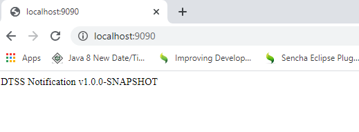

# policy-notifications-topic-adapter

## Synopsis

This standalone project is used to route messages/notifications from one topic to another topic, may it be a JMS topic or a Kafka topic.

Reference: https://egconfluence.cld.dtveng.net/display/OVINV/Common+Data+Model+Changes#CommonDataModelChanges-Newattributestopersist


## Dependencies & Prerequisites

1. JDK 8
2. Maven v3.6.2 


## Project Information
**Developers:**

Owner: jv6736


## Configurations
**1. Ask for the following files from the DEV and place it anywhere accessible on the machine where you're running this application:
	cacerts
	jaas.conf
	krb5.conf
	svc.tvod.offer.keytab
 
**2.  Open jaas.conf file and change the ``keytab`` key to the location of your keytab. **
	keyTab=<location of your keytab on step 1>

**3. Open application-dev.properties (for dev server) or application-prod.properties (for prod server) and change the following properties**

	kafka.ssl.trust-store.location=<location of your cacerts on step 1>
	kafka.sasl.jaas.config.path=<location of your jaas.conf file on step 1>
	kafka.sasl.krb.config.path=<location of your krb5.conf file on step 1>
	

**4. Specify where the log files will be located by changing the path in the 'value' attribute of the following line inside the logback.xml file:**

    <property name="LOGS" value="/host_logs/policy_notifications" />
    

## Build / Compilation

For DEV environment build using 

````bash/windows command prompt
$ mvn clean install -Pdev
````

For PROD environment build using

````bash/windows command prompt
$ mvn clean install -Pprod
````


## Deployment and Execution
After build, execute the following to run the project:

````bash
$ java -jar ./target/{your-project-compiled}.jar
````

### Testing
Test if the project is running by hitting http://<hostname>:<server.port>/ i.e http://localhost:9090/

The project version should be seen in the browser.

